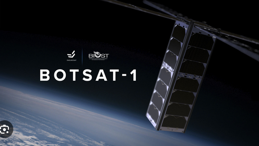

<p align="center">
  
</p>

<h1 align="center">MOPHI</h1>

<p align="center">
  <strong>Mini Orbital Ephemeris Index</strong><br>
  My implementation of real-time satellite tracking and visualization.
</p>

<p align="center">
  <a href="https://github.com/kefranabg/readme-md-generator/blob/master/LICENSE">
    
  </a>
  
  
  
</p>

---

## 🛰️ About The Project

MOPHI is a personal implementation of a satellite tracking system built to visualize the thousands of objects currently in terrestrial orbit, using real-time data to create a dynamic map of our orbital environment.

The goal was to create a tool that is both high-performing and visually intuitive, allowing anyone to explore the complex network of satellites above us.

## ✨ Implementation Details

- **Real-time Engine**: `satellite.js` to process orbital data for over 20,000+ objects simultaneously, ensuring every position is calculated live.
- **High-Performance Rendering**:  `InstancedMesh` and WebGL optimizations to maintain a smooth 60FPS experience, even with high object counts.
- **Multithreaded Processing**: To keep the UI responsive, I opted  offloaded heavy orbital mathematics to Web Workers, preventing main-thread stutters.
- **Visual Classification**: categorized satellites by orbital period for better clarity:
  - ⚪ **LEO** (Low Earth Orbit): White
  - 🟡 **MEO** (Medium Earth Orbit): Yellow
  - 🔴 **HEO** (High Earth Orbit): Red
  - 🟢 **STARLINK**: Emerald Green
- **Interactive Telemetry**: There is a built  search and selection system that provides live telemetry—including altitude, latitude, and longitude—along with projected orbit paths.

## � Data Optimization

Handling over 20,000 satellites requires efficient data management. I developed a custom Python-based **Data Compression Tool** to prepare the orbital data for the web:

- **Array Mapping**: Instead of large JSON objects, each satellite is mapped to a lightweight array format, eliminating thousands of redundant key strings.
- **Precision Balancing**: The decimal precision of orbital parameters is optimized—balancing visual accuracy with a significant reduction in character count.
- **Epoch Conversion**: ISO 8601 timestamps are converted into Unix integers to save space and simplify time-based calculations on the client side.
- **Payload Reduction**: These optimizations reduced the raw telemetry data from **8.6MB down to 3MB** (a ~65% reduction), ensuring fast initial load times and lower memory overhead.

## �🛠️ Tech Stack

- **Core**: JavaScript (ES6+)
- **Visualization**: [Three.js](https://threejs.org/) & [Three-Globe](https://github.com/vasturiano/three-globe)
- **Physics/Math**: [satellite.js](https://github.com/shashwatak/satellite-js)
- **Build Tool**: [Vite](https://vitejs.dev/)

## 🚀 Getting Started

### Prerequisites

- [Node.js](https://nodejs.org/) (Latest LTS)
- [npm](https://www.npmjs.com/)

### Installation

1. Clone the repository:
   ```bash
   git clone https://github.com/your-username/sat2.git
   cd sat2
   ```

2. Install dependencies:
   ```bash
   npm install
   ```

3. Start the dev server:
   ```bash
   npm run dev
   ```

## 📖 Usage

- **Navigation**: Rotate the globe with your mouse and use the scroll wheel to zoom.
- **Search**: Find specific satellites by name or NORAD ID using the search bar.
- **Details**: Click a satellite to view live telemetry and its predicted orbit path.
- **Tracking**: Enable "Tracking Mode" to keep the camera focused on a selected satellite.

---

<p align="center">
  Built for the curiosity of what lies above. 🛰️
</p>
